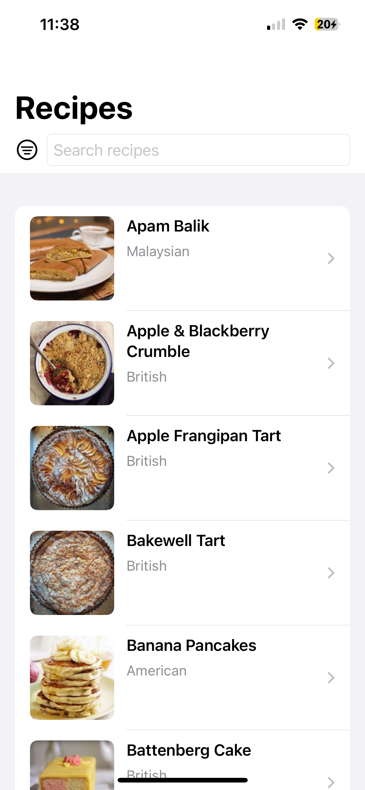
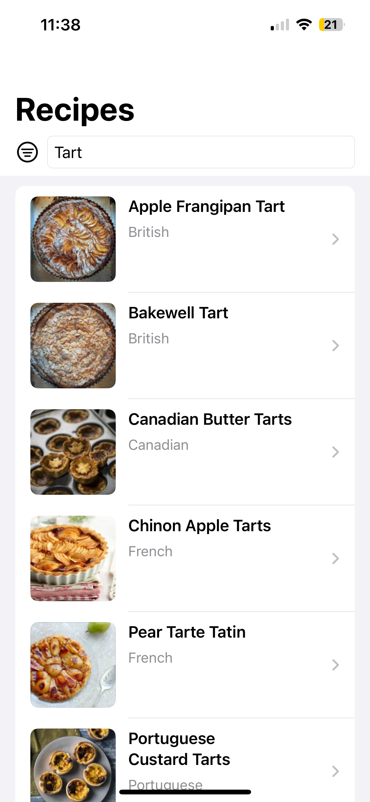
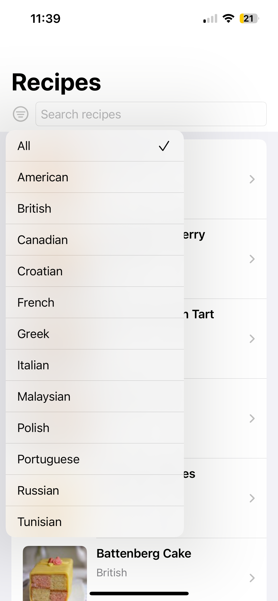
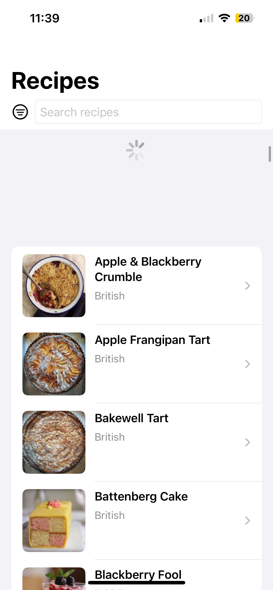
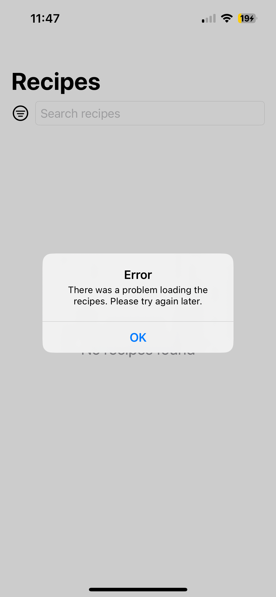

# Recipe App

## Description
Recipe App is a simple iOS application that fetches and displays recipes from a provided API. The app provides a seamless user experience with the following key features:

- **Browse Recipes**: Users can view a list of recipes, each displaying its name, cuisine type, and a photo.
- **Search**: Users can search for recipes by name, making it easy to find specific dishes.
- **Filter by Cuisine**: Recipes can be filtered by cuisine type (e.g., Italian, Mexican), allowing users to explore dishes based on their preferences.
- **Refresh**: Users can refresh the list of recipes at any time to fetch the latest data from the API.
- **Interactive Links**: Each recipe includes actionable links:
  - **Website Link**: Directs users to the recipe's original website for detailed instructions and ingredients.
  - **YouTube Link**: Provides a step-by-step video guide, enhancing the user experience with visual instructions.

These features, combined with a clean and intuitive interface, make Recipe App a powerful tool for discovering and exploring new recipes.

## Screenshots
<div align="center">
  
  
  
  
  
  
</div>

## Demo Video
[](https://youtube.com/shorts/q_r9YaC3a2Y?feature=share)

## Focus Areas
- **Swift Concurrency**: Used `async/await` for all asynchronous operations.
- **Image Caching**: Implemented custom image caching to minimize network usage.
- **Error Handling**: User-friendly error messages for issues like network errors or malformed data.
- **Testing**: Added unit tests for core functionality (data fetching, caching, and error handling).

## Time Spent
- **Total Time**: Approximately 8 hours (4 days, 2 hours per day).
- **Breakdown**:
  - Planning and setup: 1 hour.
  - Implementing core features: 4 hours.
  - Testing and debugging: 2 hours.
  - UI improvements: 1 hour.

## Trade-offs and Decisions
- **Image Caching**: Implemented a simple disk-based cache instead of a more complex solution due to time constraints.
- **Error Handling**: Chose to display errors via alerts for simplicity and user-friendliness.
- **UI**: Focused on functionality over advanced animations or transitions.

## Weakest Part of the Project
- **Image Caching**: The current implementation does not limit cache size, which could lead to excessive disk usage over time.
- **Error Handling**: Error messages could be further improved with additional guidance or solutions for users.

## Additional Information
- The app supports iOS 16 and above.
- No third-party libraries were used.

## How to Run the Project
1. Ensure you have Xcode installed (version 15 or later is recommended).
2. Clone the repository:
   ```bash
   git clone https://github.com/timarutun/RecipeApp.git
