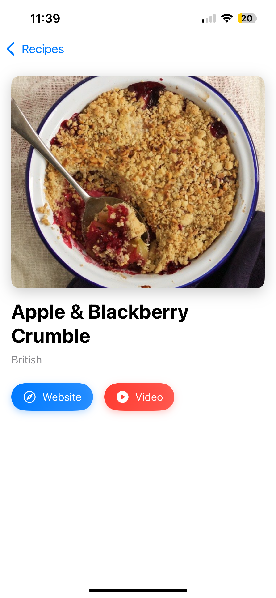

# Recipe App

## Summary
Recipe App is a simple iOS application that fetches and displays recipes from a provided API. Below are screenshots and a demo video highlighting its key features:

### Screenshots

  
  
  
  
  
  

### Demo Video

## Focus Areas
In this project, I prioritized the following areas to ensure a robust and user-friendly application:

1. **Swift Concurrency**:
   - **Why**: Modern iOS development heavily relies on asynchronous programming. By using `async/await`, I ensured that the app handles network requests and other asynchronous tasks efficiently, providing a smooth user experience without blocking the main thread.

2. **Image Caching**:
   - **Why**: Loading images from the network repeatedly can be slow and consume unnecessary bandwidth. Implementing a custom image caching mechanism allowed me to minimize network usage and improve the app's performance by storing images locally after the first load.

3. **Error Handling**:
   - **Why**: Users should never be left in the dark when something goes wrong. I focused on providing clear, user-friendly error messages for common issues like network errors or malformed data, ensuring that users understand what happened and how to proceed.

4. **Testing**:
   - **Why**: Reliable code is crucial for any application. I wrote unit tests for core functionality, such as data fetching and caching, to ensure that the app behaves as expected under various conditions. This also helps catch regressions early in the development process.

5. **User Interface (UI)**:
   - **Why**: A clean and intuitive interface is key to a positive user experience. I focused on creating a simple yet effective UI using SwiftUI, ensuring that users can easily browse, search, and filter recipes without confusion.

6. **Interactive Links**:
   - **Why**: The ability to explore recipes further via external links (website and YouTube) enhances the user experience. I made sure these links are fully integrated and easy to use, providing additional value to the user.

By focusing on these areas, I aimed to create an app that is not only functional but also efficient, reliable, and enjoyable to use.

## Time Spent
- **Total Time**: Approximately 8 hours (4 days, 2 hours per day).
- **Breakdown**:
  - Planning and setup: 1 hour.
  - Implementing core features: 4 hours.
  - Testing and debugging: 2 hours.
  - UI improvements: 1 hour.

## Trade-offs and Decisions
- **Image Caching**: Implemented a simple disk-based cache instead of a more complex solution due to time constraints.
- **Error Handling**: Chose to display errors via alerts for simplicity and user-friendliness.
- **UI**: Focused on functionality over advanced animations or transitions.

## Weakest Part of the Project
- **Image Caching**: The current implementation does not limit cache size, which could lead to excessive disk usage over time.
- **Error Handling**: Error messages could be further improved with additional guidance or solutions for users.

## Additional Information
- The app supports iOS 16 and above.
- No third-party libraries were used.
